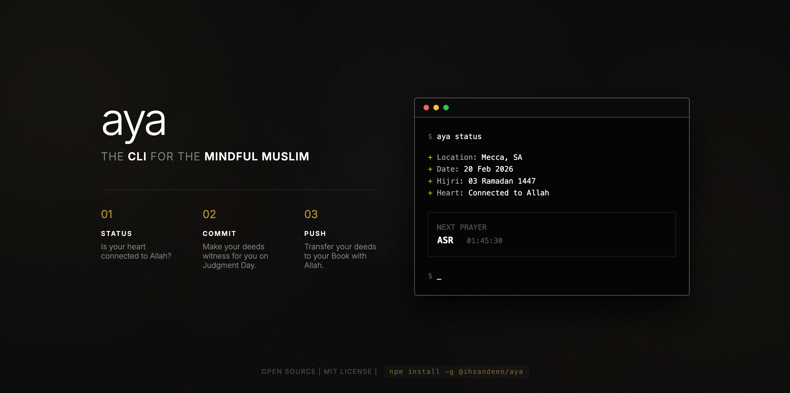
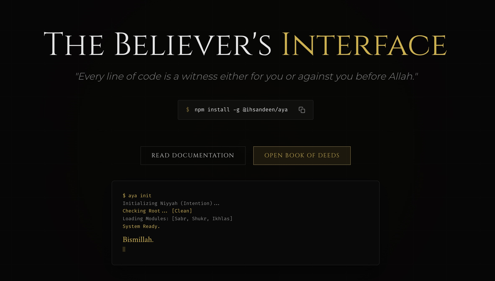
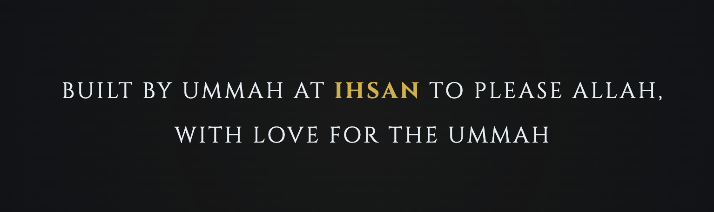

# Assalamu Alaikum Wa Rahmatullah Wa Barakatuh

# aya

> "And We have fastened every man's deeds to his neck, and on the Day of Resurrection, We shall bring out for him a book which he will find wide open." (17:13)

Listen, we need to talk.

We live in a world of inputs and outputs. We spend our days in the terminal, typing commands, expecting results, fixing bugs, and pushing code. We are obsessed with our GitHub contribution graphs. We worry about our commit history. We stress over merge conflicts.

**But have you ever stopped to think?**

What about the repository of your life? What about the "issues" in your heart that have been open for years? What about the "commits" that the Angels are recording right now, at this very second?

That's why we built **aya**.

---

## 💡 The "Insider" Story: Why We Built This

You want to know the truth? This isn't just another developer tool. It’s a response to a modern problem, **Alhamdulillah**.

We live in a time where we are hyper-connected to our repositories but disconnected from our purpose. We track every line of code, but we lose track of our spiritual state.

We realized something profound: **We are optimizing our code, but we are not optimizing our lives.**

The idea is simple yet radical: What if the very tools we use to build the dunya could be used to build our akhirah? What if `git status` could remind you of your status with Allah?

That is why **aya** exists. It is a bridge. It takes the language you already know—`git`, `status`, `push`, `pull`—and reorients it to help you track the most important project you will ever work on: **Your Soul.**

---

## ❓ Why "aya"?

People ask me, "Why did you call it aya?"

Look at the linguistics. In Arabic, **Ayah** (آية) doesn't just mean a "verse" of the Quran. It means a **Sign**. It means a **Miracle**. It means **Evidence**.

Every line of code you write can be an *ayah*—a sign of Allah's perfection. Every bug you fix can be a lesson. The sun is an ayah. The wind is an ayah. And this tool? It's a humble attempt to turn your terminal into a series of *ayat*—reminders that point you back to Him.

---



## 🚀 Quick Start (Bismillah)

You want to get started? **Bismillah**. It’s simple, **Alhamdulillah**.

```bash
# 1. Install it globally (make it part of your system)
npm install -g @ihsandeen/aya

# 2. Set your intention (Niyyah) for the session
aya init

# 3. Check your connection to the Heavens
aya status
```

---

## 🔄 The Workflow (The Real Daily Grind)

You see, the life of a believer is a constant cycle. It's not a straight line. We mapped this spiritual reality to your developer workflow. We broke it down into phases: **Initialization**, **Connection**, **Status Check**, **Syncing**, **Pushing**, and **Reflection**.

### Phase 1: Initialization (The Niyyah)

#### `aya init`
**The Spiritual Reality:** Before you write a single line of code, ask yourself: *Who is this for?* If it's for ego, it's wasted. If it's for Allah, even a `console.log` becomes worship. This command sets that frame. It configures your location, calculation method, and—most importantly—your intention.
*   **Usage:** `aya init`
*   **Output:**
    ```text
    ? What is your intention for this session? To serve the Ummah with code.
    ? Enter your city: Makkah
    ? Select Calculation Method: Muslim World League
    ? Select Madhab (for Asr): Hanafi
    🟢 Niyyah set. Bismillah.
    ```

#### `aya config`
**The Spiritual Reality:** Tarteeb (Order). Organizing your environment is half the Deen. Configure your Adhan, your location, and your preferences to ensure your tool serves you, not distracts you.
*   **Usage:** `aya config`
*   **Output:**
    ```text
    ? What would you like to configure?
    > Adhan Sound
      Location (Reset)
      Calculation Method
    ```

---

### Phase 2: Connection (The Salah & Dhikr)

#### `aya prayers`
**The Spiritual Reality:** Salah is the connection. It is the `ping` to the Heavens. If the connection drops, you are spiritually offline. It's not a ritual; it's a lifeline. Five times a day, you re-align your compass. You sync your local state with the Divine standard.
*   **Usage:** `aya prayers`
*   **Output:**
    ```text
    Fajr:     05:12 AM (Passed)
    Dhuhr:    12:30 PM (In 2 hours)
    Asr:      03:45 PM
    Maghrib:  06:15 PM
    Isha:     07:45 PM
    
    Midnight: 11:59 PM (Last Third starts)
    ```

#### `aya adhan`
**The Spiritual Reality:** The Adhan is the system interrupt. It pauses your dunya processes for the ultimate success (*Hayya 'ala al-Falah*). It's not background noise; it's a call to action.
*   **Usage:** `aya adhan`
*   **Output:**
    ```text
    Playing Adhan Makkah...
    (Audio plays)
    Interruption: Time for Salah. Code can wait.
    ```

#### `aya qibla`
**The Spiritual Reality:** Orientation matters. You can have speed, you can have power, but if the vector is wrong, you're just going faster in the wrong direction. Align your physical compass to align your spiritual heart.
*   **Usage:** `aya qibla`
*   **Output:**
    ```text
    Qibla Direction: 57.5° NE
    Distance: 8,000 km
    (ASCII Arrow pointing to Kaaba)
    ```

#### `aya wudu`
**The Spiritual Reality:** Purification. Before you touch the source code, you clean your hands. Before you touch the Quran or stand in Salah, you wash your limbs. It's not just hygiene; it's a spiritual reset. Wudu washes away the minor sins committed by the eyes, hands, and feet.
*   **Usage:** `aya wudu`
*   **Output:**
    ```text
    1. Niyyah (Intention)
    2. Hands (x3) - Dropping the sins of the grip.
    3. Mouth (x3) - Cleansing the tongue from backbiting.
    ...
    Dua: Ash-hadu an la ilaha illallah...
    ```

#### `aya recite`
**The Spiritual Reality:** The Quran is `Kalamullah`—the Speech of Allah. It's not just text data. It's living speech. When you run `recite`, you aren't just playing an audio file; you are letting the Divine speak through your hardware. It heals the chest. It reboots the heart.
*   **Usage:** `aya recite surah 1` or `aya recite ayah 2:255`
*   **Output:**
    ```text
    Playing Surah Al-Fatiha (The Opening)...
    Reciter: Mishary Alafasy
    (Audio plays with progress bar)
    ```

#### `aya adhkar`
**The Spiritual Reality:** Dhikr is the `keep-alive` signal. It keeps the heart beating. Without it, the heart hardens like a disk with bad sectors. Morning and evening, travel and sleep—these are the protection layers.
*   **Usage:** `aya adhkar morning`
*   **Output:**
    ```text
    1. Ayat al-Kursi
    2. Al-Mu'awwidhatayn (x3)
    3. Sayyidul Istighfar
    ...
    [Enter] for next
    ```

#### `aya tasbih`
**The Spiritual Reality:** The loop. SubhanAllah, Alhamdulillah, Allahu Akbar. 33 times. It's a `for` loop for the soul. It iterates over your gratitude and magnifies your Creator. Don't break the loop.
*   **Usage:** `aya tasbih`
*   **Output:**
    ```text
    SubhanAllah: [####################] 33/33
    Alhamdulillah: [#####               ] 5/33
    (Press Space to count)
    ```

#### `aya dua`
**The Spiritual Reality:** Du'a is the weapon of the believer. It is the direct line to the Admin. No pull request needed; it's an instant merge if the conditions are met. Allah is 'Al-Mujib' (The Responder). He doesn't leave you on 'read'.
*   **Usage:** `aya dua`
*   **Output:**
    ```text
    Topic: Anxiety
    "O Allah, I seek refuge in You from anxiety and sorrow..."
    (Transliteration & Translation included)
    ```

#### `aya fast`
**The Spiritual Reality:** Siyam is the firewall. It blocks incoming desires (food, anger, vain talk) so your system can cleanup and reboot. It throttles the Nafs.
*   **Usage:** `aya fast`
*   **Output:**
    ```text
    Today: Monday (Sunnah to fast)
    Suhoor Ends: 05:12 AM
    Iftar:       06:15 PM
    Status: Fasting Active
    ```

#### `aya friday`
**The Spiritual Reality:** The weekly sync. Jumu'ah is the 'master' branch update for the Ummah. Don't miss the sync. Listen to the Khutbah (patch notes) and realign.
*   **Usage:** `aya friday`
*   **Output:**
    ```text
    Checklist:
    [ ] Ghusl
    [ ] Surah Al-Kahf
    [ ] Salawat on the Prophet ﷺ
    [ ] Early to Masjid
    ```

---

### Phase 3: Status Check (The Muhasaba)

#### `aya status`
**The Spiritual Reality:** You run `git status` to see changed files. `aya status` checks your *connection to the Divine*. It tells you: "Your heart is currently on branch 'dunya'." It checks if you've missed prayers. It's a reality check. Are you online with Allah, or did you timeout?
*   **Usage:** `aya status`
*   **Output:**
    ```text
    On branch dunya
    Your branch is behind 'akhirah' by 1 prayer.
    
    Next Prayer: Asr in 02:14:05
    Current State: Need Wudu
    ```

#### `aya diff`
**The Spiritual Reality:** This isn't comparing two files. This is comparing *words*. Why did Allah use *this* specific word here and not its synonym? `aya diff` challenges you with linguistic nuances. It shows you that the Quran isn't just poetry; it's precision engineering.
*   **Usage:** `aya diff`
*   **Output:**
    ```text
    Comparing: 'Khashi'in' vs 'Khadi'in'
    ----------------------------------------
    Khashi'in: Humility that comes from awe and love (internal).
    Khadi'in: Submission that is forced or physical (external).
    
    Context: The believers are Khashi'in in their Salah.
    ```

#### `aya blame`
**The Spiritual Reality:** When code breaks, we check `git blame` to find the culprit. The believer looks in the mirror. *Nafs al-Lawwama*—the self-reproaching soul. It's healthy to admit your faults. The hypocrite blames others; the believer blames himself to improve.
*   **Usage:** `aya blame`
*   **Output:**
    ```text
    Author: You <nafs@dunya.com>
    Date:   Today
    
    Line 45: Spoke with anger
    Line 89: Wasted time on scrolling
    
    Reflection: "Nay, I swear by the self-reproaching soul..." (75:2)
    ```

#### `aya journal`
**The Spiritual Reality:** Tazkiyah (Purification). You need to debug your heart. What state is it in? Anxious? Grateful? Distracted? `aya journal` is a spiritual debugger that prescribes Quranic medicine for your emotional state.
*   **Usage:** `aya journal`
*   **Output:**
    ```text
    How is your heart feeling right now?
    > Anxious
    
    Prescription for Anxious:
    "Unquestionably, by the remembrance of Allah hearts are assured." (13:28)
    
    Advice: Anxiety comes from fearing the future. Let go of the control you never had.
    Prescribed Dhikr: Hasbunallahu wa ni'mal wakil
    ```

#### `aya repo`
**The Spiritual Reality:** Imagine if you could see your Book of Deeds right now. This command opens a UI to visualize your spiritual contributions. It's eye-opening. Are your contributions green (good deeds) or red (sins)?
*   **Usage:** `aya repo`
*   **Output:**
    ```text
    Opening repository visualization on http://localhost:3000...
    Displaying contribution graph...
    ```

---

### Phase 4: Syncing (The Knowledge)

#### `aya pull`
**The Spiritual Reality:** We think we generate success. No. We just pull from the provision that was already written. Ask for guidance, and pull it down. Always be pulling from the source (Quran & Sunnah) to stay updated.
*   **Usage:** `aya pull`
*   **Output:**
    ```text
    From origin heavens
     * branch            rizq       -> FETCH_HEAD
    Updating 34a...89b
    Fast-forward
     guidance.txt | 1 +
     peace.json   | 5 +++++
    2 files changed, 6 insertions(+)
    ```

#### `aya tafsir`
**The Spiritual Reality:** Documentation. You can read code, but do you understand the architecture? Tafsir explains the *why* and *how*. It's the comments left by the Author and the scholars. Without it, you might misinterpret the function.
*   **Usage:** `aya tafsir surah 112`
*   **Output:**
    ```text
    Surah Al-Ikhlas (The Sincerity)
    
    Explanation: This Surah equates to one-third of the Quran.
    It establishes pure Monotheism (Tawhid) and negates any partners...
    ```

#### `aya seek`
**The Spiritual Reality:** Search. `grep` for the soul. You have a question? Seek the answer in the Revelation. Don't rely on your own logic alone.
*   **Usage:** `aya seek patience`
*   **Output:**
    ```text
    Searching for 'patience'...
    
    [2:153] "O you who have believed, seek help through patience and prayer..."
    [3:200] "O you who have believed, persevere and endure..."
    ```

#### `aya memorize`
**The Spiritual Reality:** Hifz (Guarding). Hifz means to guard/protect. When you memorize Quran, you are guarding it in your chest. But it also guards *you*. The Prophet ﷺ said the one without Quran in their heart is like a ruined house. We use **Spaced Repetition** to help you retain the Words of the Creator.
*   **Usage:** `aya memorize`
*   **Output:**
    ```text
    Question: Al-Hamdu lillahi _____ Al-Alamin
    Your Answer: Rabb
    Correct! (Ease Factor increased)
    Next review: Tomorrow
    ```

#### `aya names`
**The Spiritual Reality:** To know the Admin, you must know His names. He is Al-Razzaq (The Provider), Al-Wadud (The Loving). Calling Him by the specific name for your specific bug (problem) is the key to the solution.
*   **Usage:** `aya names`
*   **Output:**
    ```text
    Name: Al-Fattah (The Opener)
    Meaning: The One who opens closed doors and reveals the solution.
    Reflection: Stuck on a bug? Ask Al-Fattah to open the logic for you.
    ```

#### `aya parable`
**The Spiritual Reality:** Amthal. The Quran uses metaphors—a spider's web, a fly, a light. These are unit tests for your understanding. If you don't get the parable, you miss the lesson.
*   **Usage:** `aya parable`
*   **Output:**
    ```text
    Parable: The Spider's House
    "The frailest of houses is the house of the spider..." (29:41)
    Lesson: Relying on anything other than Allah is like building a web. It looks structured, but it collapses with a breath.
    ```

#### `aya sunnah`
**The Spiritual Reality:** The Best Practices. The Prophet ﷺ set the standard. His life is the documentation for the perfect human implementation. Why reinvent the wheel? Follow the Sunnah.
*   **Usage:** `aya sunnah`
*   **Output:**
    ```text
    Habit: Sleeping on the right side.
    Benefit: Physical rest and spiritual following.
    Action: Intend it tonight.
    ```

#### `aya history`
**The Spiritual Reality:** The git log of the Ummah. We stand on the shoulders of giants. Knowing your history prevents you from introducing old bugs (heresies) into the new branch.
*   **Usage:** `aya history`
*   **Output:**
    ```text
    On this day: Battle of Badr (17 Ramadan)
    Event: 313 believers stood against 1000.
    Lesson: Victory is from Allah, not numbers.
    ```

#### `aya hero`
**The Spiritual Reality:** Who are your dependencies? Who do you inherit properties from? The Sahaba are the 'Core Contributors' of this Deen. Learn their profiles to upgrade your own character class.
*   **Usage:** `aya hero`
*   **Output:**
    ```text
    Hero: Mus'ab ibn Umair (RA)
    Trait: Sacrifice. Left the luxury of Makkah for the rough skin of a Da'ee.
    Reflection: What have you given up for this code?
    ```

#### `aya nazm`
**The Spiritual Reality:** Coherence. The Quran isn't random. It has a ring structure, a perfect architecture. `aya nazm` reveals the hidden symmetry in the Surahs.
*   **Usage:** `aya nazm`
*   **Output:**
    ```text
    Surah Yusuf: Ring Composition
    A. The Dream (Vision)
      B. Lost in the Well
        C. The Palace (Temptation)
      B'. Found in the Palace
    A'. The Interpretation (Reality)
    ```

#### `aya journey`
**The Spiritual Reality:** The Roadmap. We are all travelers. This command maps the stages: Life -> Death -> Barzakh -> Resurrection. Know where you are on the timeline.
*   **Usage:** `aya journey`
*   **Output:**
    ```text
    Stage: Dunya (The Testing Ground)
    Next Milestone: The Grave.
    Action Item: Prepare the answers for the 3 Questions.
    ```

---

### Phase 5: Pushing (The Action)

#### `aya add`
**The Spiritual Reality:** I'dad (Preparation). "And prepare against them whatever you are able of power." (8:60). Preparation is half the victory. When you stage intentions, you are deliberately choosing what becomes part of your history. Don't just drift through life. Stage your day. Stage your prayers. Be intentional about what you are about to commit to your book of deeds.
*   **Usage:** `aya add "Visit the sick"`
*   **Output:**
    ```text
    [+] Staged: "Visit the sick"
    (Use 'aya commit' to record this deed)
    ```

#### `aya commit`
**The Spiritual Reality:** Every smile, every charity, every moment of patience—that's a commit. And unlike git, you can't `reset --hard` these commits once the time passes. Make them count.
*   **Usage:** `aya commit -m "Helped a neighbor"`
*   **Output:**
    ```text
    [main 7f3a2b] Helped a neighbor
     1 file changed, 10 insertions(+)
     Reward: Recorded in your Book of Deeds.
    ```

#### `aya push`
**The Spiritual Reality:** You have anxieties? You have bugs you can't fix? Push them up. The Server is always listening. The bandwidth is infinite. Send your Duas to production.
*   **Usage:** `aya push`
*   **Output:**
    ```text
    Pushing to origin heavens...
    Uploading... 100%
    Remote: Your Lord says: "Call upon Me; I will respond to you."
    To https://api.heavens.divine/dua
    ```

#### `aya invest`
**The Spiritual Reality:** Allah asks: 'Shall I tell you of a trade (Tijarah) that will save you from a painful punishment?' The believer is an investor. You trade your time and wealth in this Dunya for a return in Jannah. It's a long-term hold.
*   **Usage:** `aya invest`
*   **Output:**
    ```text
    Portfolio Analysis:
    - Dunya Assets: Depreciating
    - Akhira Assets: Compounding
    
    Recommendation: Give Sadaqah now to hedge against loss.
    ```

#### `aya zakat`
**The Spiritual Reality:** Garbage Collection. You purify your wealth by removing the 2.5% that doesn't belong to you. If you keep it, it corrupts the whole heap. Cleanse your assets. **Now features Live Nisab calculation using real-time Gold & Silver prices.**
*   **Usage:** `aya zakat`
*   **Output:**
    ```text
    Fetching live Gold & Silver prices...
    ✔ Market Rates Loaded.

    Current Gold Price:   $65.40 /g
    Current Silver Price: $0.85 /g
    Nisab (Gold Standard):    $5,721.19
    Nisab (Silver Standard):  $520.51

    ? Cash on hand / Bank accounts: 10000
    ...
    
    Assets:
    - Gold: $5000
    - Cash: $10000
    Total: $15000
    Zakat Due (2.5%): $375
    Status: Pending Payment.
    ```

#### `aya adab`
**The Spiritual Reality:** Adab is the API of human interaction. A scholar said 'Make your knowledge salt, and your Adab the flour'. You need more manners than raw data. How do you comment on PRs? Harshly? Or with Adab?
*   **Usage:** `aya adab`
*   **Output:**
    ```text
    Topic: Parents
    "And lower to them the wing of humility out of mercy..." (17:24)
    Action: Call your mother today.
    ```

#### `aya sabr`
**The Spiritual Reality:** Error Handling. Sabr isn't passive; it's active endurance. It's catching the exception without crashing the system. It's maintaining state under high load.
*   **Usage:** `aya sabr`
*   **Output:**
    ```text
    Status: Under Trial
    Verse: "Indeed, Allah is with the patient." (2:153)
    Advice: Don't complain to the people; complain to the Lord of the people.
    ```

#### `aya shukr`
**The Spiritual Reality:** The Scaling Factor. "If you are grateful, I will surely increase you." Gratitude is the algorithm for abundance. You want more? Optimize your gratitude.
*   **Usage:** `aya shukr`
*   **Output:**
    ```text
    List 3 blessings today:
    1. Eyesight
    2. Iman
    3. Coffee
    Result: Blessings preserved and increased.
    ```

---

### Phase 6: Environment (The Reflection)

#### `aya nature`
**The Spiritual Reality:** The signs (Ayat) are not just in the Book; they are in the horizon. The sun, the moon, the ants. `aya nature` forces you to look up from your screen and decode the universe.
*   **Usage:** `aya nature`
*   **Output:**
    ```text
    Observation: The Bee
    "And your Lord inspired to the bee..." (16:68)
    Reflection: Look at the architecture of the honeycomb. Hexagons. Efficiency.
    Who taught it geometry?
    ```

#### `aya scene`
**The Spiritual Reality:** Visualizing the inevitable. It renders a scene from the Day of Judgment to put your worldly stress in perspective.
*   **Usage:** `aya scene`
*   **Output:**
    ```text
    Scene: The Weighing of Deeds
    "And the weighing on that Day is the truth..."
    Question: Is your scale heavy with code or heavy with sincerity?
    ```

#### `aya anatomy`
**The Spiritual Reality:** The Hardware Specs. You are not just a body. You are Nafs (Ego), Qalb (Heart), and Ruh (Spirit). `aya anatomy` helps you debug which component is causing the issue.
*   **Usage:** `aya anatomy`
*   **Output:**
    ```text
    Component: The Qalb (Heart)
    Status: Rusting from sins.
    Fix: Polish it with Istighfar.
    ```

#### `aya lens`
**The Spiritual Reality:** The Filter. Viewing the Dunya through the lens of the Akhirah. It changes how you see a "loss". A loss in dunya might be a gain in akhira.
*   **Usage:** `aya lens`
*   **Output:**
    ```text
    Input: "I lost my job."
    Lens: "Perhaps Allah wants you to rely on Him, not the paycheck."
    Refracted Reality: An opportunity for Tawakkul.
    ```

#### `aya mirror`
**The Spiritual Reality:** The Debugger. "The believer is the mirror of the believer." If you see a fault in your brother, check if it exists in you. It's a reflection.
*   **Usage:** `aya mirror`
*   **Output:**
    ```text
    Reflection: You were annoyed by his anger.
    Self-Check: Do you get angry when things don't go your way?
    Action: Fix the bug in your own repo.
    ```

#### `aya watch`
**The Spiritual Reality:** Muraqabah (Vigilance). Knowing that the Admin is watching every keystroke. It's running your life in `verbose` mode. Technically, `aya watch` is a daemon that runs in the background to ensure you never miss a prayer. It is the muezzin of your operating system.
*   **Usage:** `aya watch` (Run in foreground) or `aya watch --install` (Run as daemon)
*   **Output:**
    ```text
    [12:30] Loaded prayer times for New York.
    [13:15] It is time for Dhuhr! Hayya 'ala-s-Salah.
    (Playing Adhan...)
    ```

#### `aya sound`
**The Spiritual Reality:** Ambient Mode. The Quran was revealed as sound. `aya sound` mixes calming nature sounds with recitation to help you focus (Khushu).
*   **Usage:** `aya sound`
*   **Output:**
    ```text
    Playing: Rain + Surah Rahman
    Focus Level: High
    (Audio playing...)
    ```

#### `aya hijri`
**The Spiritual Reality:** The System Clock. The Islamic calendar is lunar; it's natural, not solar/artificial. It reminds us that time is defined by the migration (Hijrah) from evil to good.
*   **Usage:** `aya hijri`
*   **Output:**
    ```text
    Date: 14 Ramadan 1447 AH
    Event: The moon is full. The White Days are here.
    Action: Fast tomorrow?
    ```

#### `aya sleep`
**The Spiritual Reality:** The minor death. Sleep is a shutdown. Your soul departs. Will it return? Recite the Adhkar of sleep to ensure a safe shutdown and a blessed reboot.
*   **Usage:** `aya sleep`
*   **Output:**
    ```text
    Running Shutdown Sequence...
    1. Recite Ayat al-Kursi
    2. Recite 3 Quls
    3. Forgive everyone
    System Halted. See you at Fajr InshaAllah.
    ```

---

## 🌙 The Nuance (Ihsan in the Details)

We didn't just build a CLI. We built it with **Ihsan** (Excellence). Because the Ummah deserves tools that are calculated, precise, and respectful of their reality.

### 1. The "Forgetful" User (Fuzzy Matching)
**The Problem:** You type `aya memorize al fatiha`. The system expects `Al-Fatiha`. In the past, it would throw `Error: 404 Not Found`.
**The Ihsan:** Allah is Merciful with our stumbling. He appreciates the effort even if the execution is flawed. So we added the **Levenshtein Distance** algorithm.
*   **Result:** It understands your intent. It says, "Did you mean *Al-Fatiha*? (85% match)". It accepts your effort. It doesn't reject you for a typo.

### 2. The "Remote" User (Offline Capability)
**The Problem:** You’re on a flight. You’re in a remote village. You have no signal. Does your connection to Allah stop?
**The Ihsan:** We implemented aggressive **Local Caching**.
*   **Prayer Times:** Calculated for the entire month and stored in `~/.aya/cache`.
*   **Recitation:** Once you stream a Surah, it's saved. We check disk before network. We respect your bandwidth and your location. You can be offline from the web, but never offline from Him.

### 3. The "Confused" User (Error Handling)
**The Problem:** You run a command that doesn't exist. `aya jannah`.
**The Ihsan:** Instead of a cold `Syntax Error`, we give guidance.
*   **Result:** "Command not found. But Jannah is found through `aya prayers` and `aya commit`. Try those." We turn even errors into reminders.

### 4. The "Diverse" User (Madhab Flexibility)
**The Problem:** The Ummah is not a monolith. We have differences.
**The Ihsan:** We added **Madhab Selection** in `aya init`.
*   **Asr Calculation:** Whether you follow the Standard (Shafi'i/Maliki/Hanbali) view (Shadow 1:1) or the Hanafi view (Shadow 2:1), `aya` respects it. We don't force a single view; we accommodate the richness of our tradition.

### 5. The "Private" User (Local Storage)
**The Problem:** You pour your heart out in `aya journal`. You write about your sins. You don't want that on a cloud server.
**The Ihsan:** **Privacy by Design**.
*   **Storage:** All your journal entries, muhasaba logs, and personal reflections are stored locally in `~/.aya/data`. Encrypted by your own sincerity. We don't track you. Your relationship with Allah is private.

---

[](https://www.ihsandeen.com/)

## 💡 11 Ways We Want to Make It Better (Which You Can Too)

You know, the Quran speaks of "Sabiquna as-Sabiqun"—the Foremost. Those who don't just do the bare minimum, but race to do good. We have a vision, **inShaAllah**, but we can't build it alone. We need the *Sabiqun*.

Here are 11 ways we envision this tool growing. Which one will be your legacy?

1.  **Mobile App Sync (The Companion)**: The Prophet ﷺ was always connected to Allah, whether walking or riding. We want to sync your CLI data with a mobile app so your spiritual state travels with you, not just on your desktop.
2.  **Advanced Tajweed Analysis (The Tongue)**: "Warattil il-Qurana tartila." We want to use AI to listen to your recitation and gently correct your pronunciation. Imagine an algorithm that helps you recite the Words of Allah perfectly.
3.  **Community Challenges (The Jama'ah)**: The wolf eats the lone sheep. We want global khatam or dhikr challenges where the entire Ummah competes in good deeds. "Fastabiq al-khayrat" - Race towards the good.
4.  **More Madhabs (The Richness)**: Our Fiqh is a vast ocean. We want expanded, detailed support for Shafi'i, Maliki, and Hanbali rulings. We want to honor the scholarship of the past with the code of the future.
5.  **Multi-Language Support (The Tongues)**: "And of His signs is the creation of the heavens and the earth and the diversity of your languages." We need Arabic, Urdu, French, Indonesian. Let the code speak to every believer.
6.  **Quran Hifz Tester (The Guardian)**: You think you memorized it? Let the system test you. Voice recognition to catch the mistakes before you lead Salah. It’s about *Itqan* (perfection).
7.  **Smart Watch Integration (The Pulse)**: A vibration on your wrist for prayer. A gentle nudge for Dhikr. Technology shouldn't distract you; it should remind you.
8.  **Knowledge Graph (The Connection)**: Everything in Islam is connected. We want to visualize the web between Ayahs, Hadiths, and historical events. See the *Seerah* as a living network, not just a list of dates.
9.  **Halal Investment Tracker (The Rizq)**: "Eat of the good things We have provided." We want APIs to screen stocks and track halal investments. Because pure Rizq leads to pure deeds.
10. **Mosque Finder (The Houses)**: Where is the nearest House of Allah? Locate Masjids and Jama'ah times directly from your terminal. Connect the digital believer to the physical community.
11. **Open Source API (The Sadaqah)**: We don't want to hoard this data. We want to build a public API for other Islamic apps. Let your code be the foundation for a thousand other apps.

## 🤝 Contributing (Sadaqah Jariyah)

Listen, this project isn't about me. It's about *us*. It's a **Sadaqah Jariyah**—a continuing charity. Imagine someone using this tool and remembering Allah because of a line of code you wrote. That's a reward that continues even after you're gone.

### 📧 Need Support? (The Nasiha)

The believers are like one body. If one part aches, the rest feels it. If you have questions, feedback, or just want to say Salam, reach out. We are here to serve.
Email us at: **salam@ihsandeen.com**

**Want to earn that reward?** 👇

1.  **Clone it**: `git clone https://github.com/ihsandeen/aya.git`
2.  **Install it**: `npm install`
3.  **Build it**: `npm run build`
4.  **Link it**: `npm link`

If you find a bug, fix it. If you have an idea, build it. Do it with *Ihsan* (excellence).

---

*May Allah accept this humble effort from us and make it a witness for us on the Day of Judgment.* 🤲

**inShaAllah will increase in future as Allah finds fit.**
